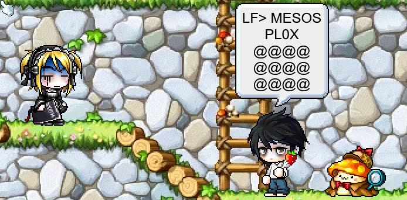

<p align="center">
  
</p>

<p align="center">
  A MapleStory dress up sim<br>
  Pick items from the closet, see your character wearing them, pose them, put them on a map, save the picture.
</p>

<p align="center">
  <b><a href="https://henehoe.app">henehoe.app</a></b>
</p>

## Feature

- Layered rendering for pants + overalls combos
- Poses, expressions, skin tones, ear variants, item fx
- Several characters on one stage, each dragged where you want
- Speech balloons and labels
- Export as PNG / GIF, import from JSON

<p align="center">
  
</p>


## Stack

- Next.js 14 (App Router) with `output: 'export'`, static file build
- TS | React 18 | Mantine | typestyle | SCSS

Content extracted with [WzComparerR2](https://github.com/Kagamia/WzComparerR2)

`.mjs` scripts build the indexes, the icons and the
webp conversions

## Run locally

```bash
npm install
npm run dev
```

The closet will be empty without the extracted art, which is not in this repo and is a few GB
`public/avatar` is expected to be a junction onto the extraction output
`NEXT_PUBLIC_ASSET_BASE` points the app at a different host if you have one

### Scripts

| command | function |
| --- | --- |
| `npm run dev` | dev server |
| `npm run build` | static export |
| `npm run maps` | rebuild `public/maps/index.json` after adding a map |
| `npm run webp` | convert plates and layer sprites to webp |
| `npm run webp -- --prune-still` | drop sprites the renderer never requests |
| `node scripts/build-readme-art.ts` | redraw the pictures on this page |
| `node scripts/deploy.mjs --dry` | say what a deploy would send |
| `node scripts/deploy.mjs` | build and ship the site |
| `node scripts/deploy.mjs --assets` | the site, + any assets the box is missing |
| `node scripts/deploy.mjs --clean` | the site, after emptying the web root (for after deleting map or pruning sprites. Deleted items under `avatar/` are never removed either, deliberately,
since they are served `immutable` for a year)|

needs `DEPLOY_HOST` and `DEPLOY_PATH` in `.env.local`

## Disclaimer

This is an unofficial, non-commercial fan project. **Not affiliated with,
endorsed by, or sponsored by Nexon.** MapleStory and all related art, names and
assets are © NEXON Korea Corp.

The bulk of the extracted art, the character sheets, is not in this repo at all